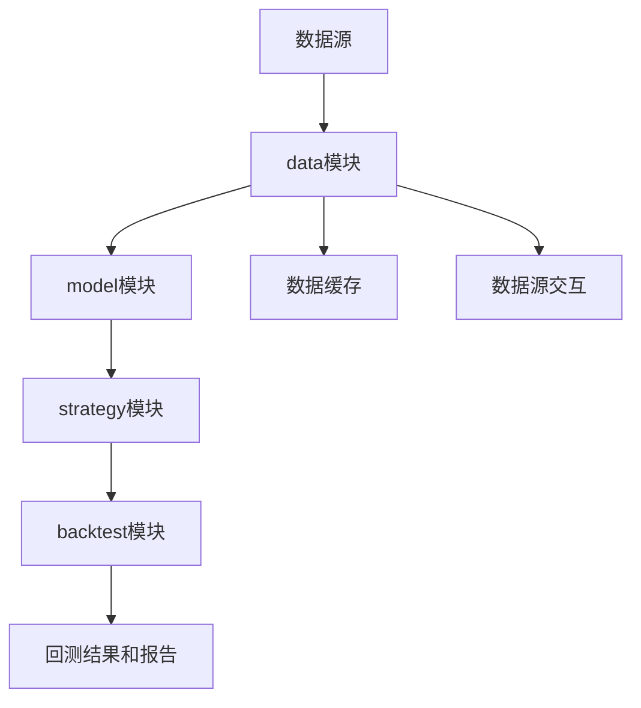

# qlib代码解读

#### qlib完整目录文件

这个脚本会遍历当前目录下的所有文件，并将文件名保存到名为 `qlib.yaml` 的文件中。您可以将脚本保存为 `统计文件名.py`，然后运行它来执行统计操作。执行完成后，您将在当前目录下找到生成的 `qlib.yaml` 文件，其中包含了文件名的列表。

```python
import os
import yaml

def get_files(directory):
    files = []
    for root, _, filenames in os.walk(directory):
        for filename in filenames:
            files.append(os.path.join(root, filename))
    return files

def save_to_yaml(files, output_file):
    data = {'files': files}
    with open(output_file, 'w') as f:
        yaml.dump(data, f)

if __name__ == '__main__':
    current_directory = os.getcwd()
    files = get_files(current_directory)
    output_file = 'qlib.yaml'
    save_to_yaml(files, output_file)
    print(f"文件名已保存到 {output_file} 中。")

```

#### 基本介绍

1. `config.py`：包含了qlib的配置信息，例如数据存储路径、日志级别等。
2. `log.py`：提供了日志记录的功能，用于在代码中输出日志信息。
3. `typehint.py`：包含了一些类型提示的定义，用于增强代码的可读性和可维护性。
4. `dir.py`：提供了一些目录操作的函数，用于处理文件和文件夹的路径。
5. `constant.py`：定义了一些常量，例如交易类型、数据频率等。
6. `get_data.py`：定义了获取数据的函数，用于从数据源获取金融数据。
7. `data.py`：包含了一些数据处理的函数和类，用于处理金融数据，例如数据过滤、操作等。
8. `model`：包含了模型相关的代码，用于训练和使用机器学习模型。
9. `trainer.py`：定义了模型训练的函数和类，用于训练机器学习模型。
10. `utils.py`：包含了一些常用的工具函数和类，用于辅助数据处理、模型训练等。
11. `strategy`：包含了策略相关的代码，用于实现交易策略。
12. `backtest`：包含了回测相关的代码，用于进行交易策略的回测和评估。
13. `workflow`：提供了一些工作流相关的功能，用于管理和执行金融实验的流程。
14. `rl`：包含了强化学习相关的代码，用于实现基于强化学习的交易策略。
15. `contrib`：包含了一些贡献代码，提供了额外的功能和模型。
16. `evaluate_portfolio.py`：提供了评估投资组合的功能，例如计算夏普比率、最大回撤等。
17. `torch.py`：包含了与PyTorch相关的代码，用于构建和训练深度学习模型。
18. `rolling`：提供了滚动计算相关的功能，例如滚动平均、滚动标准差等。
19. `ops`：包含了一些运算相关的函数和类，用于执行高频交易相关的操作。
20. `data`：包含了数据处理相关的代码，用于处理金融数据，例如数据预处理、特征工程等。
21. `online`：提供了在线学习相关的功能，用于实现在线学习的交易策略。
22. `eva`：提供了一些评估模型性能的功能，例如计算因子收益、因子IC等。
23. `tuner`：提供了模型调优相关的功能，例如超参数优化、模型选择等。
24. `meta`：提供了一些元数据相关的功能，用于数据选择和模型选择。
25. `report`：提供了生成报告和图表的功能，用于展示交易策略的结果和分析。
26. `storage`：提供了数据存储相关的功能，用于数据的读取和存储。

##### data部分介绍

`data`部分是qlib库中用于处理金融数据的模块，它包含了一些数据处理相关的代码和功能。下面对`data`部分的一些关键模块进行详细描述：

1. `base.py`：定义了`BaseDataHandler`类，是数据处理的基类。它提供了一些通用的数据处理方法，例如数据加载、数据过滤、数据切片等。

2. `filter.py`：定义了一些数据过滤相关的函数和类，用于根据条件过滤数据。例如，可以根据时间范围、股票代码等条件对数据进行过滤。

3. `ops.py`：包含了一些数据操作相关的函数和类，用于执行一些常见的数据操作。例如，可以计算收益率、计算滚动平均等。

4. `inst_processor.py`：定义了`InstrumentProcessor`类，用于处理金融工具（Instrument）的数据。它提供了一些常用的金融工具数据处理方法，例如获取金融工具的交易日历、行业分类信息等。

5. `cache.py`：定义了`DataCache`类，用于缓存数据，以提高数据访问的效率。它可以将经常访问的数据缓存到内存中，避免重复加载和处理数据。

6. `client.py`：定义了`DataClient`类，用于与数据源进行交互，获取金融数据。它提供了一些方法，例如从数据源下载数据、更新数据等。

7. `pit.py`：定义了`PITDataHandler`类，是基于时间切片的数据处理器。它可以根据时间切片加载和处理数据，以支持按时间顺序进行回测和模型训练。

8. `dataset`：包含了一些数据集相关的代码，用于组织和管理金融数据集。例如，`DatasetLoader`类用于加载数据集，`DatasetProcessor`类用于处理数据集。

9. `storage`：提供了数据存储相关的功能，用于数据的读取和存储。例如，`DataStorage`类用于读取和存储数据，`FileStorage`类用于读取和存储文件。

以上是`data`部分的一些关键模块和功能的描述。这些模块和功能提供了丰富的数据处理工具和方法，用于处理金融数据，例如加载数据、过滤数据、计算指标等。通过这些功能，用户可以方便地进行数据预处理、特征工程和数据分析，以支持后续的模型训练和交易策略开发。

##### model部分介绍

`model`部分是qlib库中用于构建和训练机器学习模型的模块，它包含了一些与模型相关的代码和功能。下面对`model`部分的一些关键模块进行详细描述：

1. `base.py`：定义了`BaseModel`类，是模型构建和训练的基类。它提供了一些通用的模型构建和训练方法，例如模型初始化、模型训练、模型保存等。

2. `estimator.py`：定义了`Estimator`类，用于模型的评估和预测。它提供了一些评估指标的计算方法，例如均方误差（MSE）、平均绝对误差（MAE）等。

3. `torch.py`：包含了与PyTorch相关的代码，用于构建和训练深度学习模型。它提供了一些深度学习模型的实现，例如多层感知机（MLP）、卷积神经网络（CNN）、循环神经网络（RNN）等。

4. `trainer.py`：定义了模型训练的函数和类，用于训练机器学习模型。它提供了一些训练相关的方法，例如批量训练、在线学习等。

5. `ensemble.py`：定义了集成学习相关的类，用于构建和训练集成模型。它提供了一些集成学习的方法，例如随机森林（Random Forest）、梯度提升（Gradient Boosting）等。

6. `predictor.py`：定义了`Predictor`类，用于模型的预测。它提供了一些预测方法，例如给定输入数据，输出模型的预测结果。

7. `model`：包含了一些预定义的模型，用于快速构建和训练模型。例如，`LinearModel`类是一个简单的线性回归模型，`XGBModel`类是基于XGBoost的模型。

8. `serialization`：提供了模型序列化和反序列化的功能，用于保存和加载模型。例如，可以将训练好的模型保存到文件中，以便后续使用。

9. `selection`：提供了模型选择相关的功能，用于选择最优的模型。例如，可以通过交叉验证等方法选择最佳的超参数组合。

以上是`model`部分的一些关键模块和功能的描述。这些模块和功能提供了丰富的机器学习模型构建和训练工具，支持常见的机器学习算法和深度学习算法。用户可以根据自己的需求选择合适的模型，并使用提供的方法进行模型训练、评估和预测。通过这些功能，用户可以快速构建和训练自己的机器学习模型，用于金融数据分析和交易策略开发。

##### Strategy部分介绍

`strategy`部分是qlib库中用于策略开发和回测的模块，它包含了一些与策略相关的代码和功能。下面对`strategy`部分的一些关键模块进行详细描述：

1. `base.py`：定义了`BaseStrategy`类，是策略开发的基类。它提供了一些通用的策略方法和属性，例如策略初始化、交易执行等。

2. `signal.py`：定义了一些信号生成相关的函数和类，用于生成交易信号。例如，可以根据技术指标、市场数据等生成买入和卖出信号。

3. `position.py`：定义了`Position`类，用于管理策略的持仓信息。它提供了一些方法，例如计算持仓市值、调整持仓比例等。

4. `account.py`：定义了`Account`类，用于管理策略的资金账户。它提供了一些方法，例如计算账户价值、调整资金分配等。

5. `backtest.py`：定义了回测相关的函数和类，用于进行策略的回测。它提供了一些回测相关的方法，例如回测结果的计算、回测报告的生成等。

6. `benchmark.py`：定义了`Benchmark`类，用于设置策略的基准指数。它提供了一些基准指数相关的方法，例如获取基准指数的收益率、计算基准指数的回测结果等。

7. `order.py`：定义了`Order`类，用于管理策略的交易订单。它提供了一些方法，例如生成交易订单、执行交易等。

8. `position_effect.py`：定义了交易的持仓影响模型，用于计算交易对策略持仓的影响。它提供了一些常见的持仓影响模型，例如市价模型、限价模型等。

9. `slippage.py`：定义了交易的滑点模型，用于模拟实际交易中的滑点情况。它提供了一些常见的滑点模型，例如固定滑点模型、百分比滑点模型等。

以上是`strategy`部分的一些关键模块和功能的描述。这些模块和功能提供了丰富的策略开发和回测工具，支持用户根据自己的需求开发和测试交易策略。用户可以使用提供的方法生成交易信号、管理持仓和资金账户、执行交易订单等。通过这些功能，用户可以进行策略的回测和评估，以验证和优化自己的交易策略。

##### Backtest部分介绍

`backtest`部分是qlib库中用于策略回测的模块，它提供了一些函数和类，用于执行策略的历史回测并生成回测报告。下面对`backtest`部分的一些关键模块进行详细描述：

1. `backtest.py`：定义了`run_backtest`函数，用于执行策略的历史回测。该函数接受一个策略对象、数据集、回测起止时间等参数，并返回回测结果。

2. `report.py`：定义了`generate_report`函数，用于生成回测报告。该函数接受回测结果和其他相关参数，并生成包括回测曲线、绩效指标、交易记录等内容的报告。

3. `metrics.py`：定义了一些用于计算回测绩效指标的函数。例如，可以计算年化收益率、夏普比率、最大回撤等指标。

4. `plot.py`：定义了一些绘图函数，用于可视化回测结果。例如，可以绘制回测曲线、资金曲线、持仓比例等图表。

5. `record.py`：定义了`Record`类，用于记录回测过程中的交易记录和持仓信息。它提供了一些方法，例如记录交易订单、更新持仓信息等。

6. `position.py`：定义了`Position`类，用于管理回测过程中的持仓信息。它提供了一些方法，例如计算持仓市值、调整持仓比例等。

以上是`backtest`部分的一些关键模块和功能的描述。通过使用这些模块和功能，用户可以将自己开发的策略应用于历史数据，并进行回测分析。用户可以获取回测结果、计算绩效指标、生成回测报告，并通过可视化图表进行结果展示。这些功能可以帮助用户评估策略的效果、优化参数和规则，并为实际交易提供参考依据。

##### 数据路径流程图



#### 流程描写细讲

- 数据的配置信息

```python
@task(name="init")
def init(config):
    provider_uri = config["qlib_init"]["provider_uri"]
    reg = config["qlib_init"]["region"]
    qlib.init_qlib(provider_uri=provider_uri, region=reg)
    logger = get_run_logger()
    logger.info("init qlib success")
```

调用了qlib.init_qlib()

以上代码是qlib库的初始化部分，主要用于进行qlib的初始化设置和配置。下面对代码的具体含义和作用进行描述：

1. 导入所需的库和模块：
   - `os`：用于操作系统相关的功能。
   - `yaml`：用于读取和解析YAML格式的配置文件。
   - `logging`：用于日志记录和输出。
   - `platform`：用于获取当前操作系统的信息。
   - `subprocess`：用于执行外部命令。
2. 定义了一个函数`init_qlib`，用于初始化qlib库：
   - `default_conf`参数指定了默认的配置文件，可选值为"client"或"server"。
   - `**kwargs`用于接收额外的参数。
3. 通过`get_module_logger`函数获取日志记录器。
4. 根据`skip_if_reg`参数的值判断是否跳过初始化。如果`skip_if_reg`为True且已经注册过，则跳过初始化。
5. 根据`clear_mem_cache`参数的值判断是否清空内存缓存。
6. 使用`C.set`方法设置配置项，其中`C`是qlib库的配置对象，用于管理和访问各种配置项。
7. 设置日志记录器的日志级别。
8. 遍历`C.provider_uri`中的数据提供商URI，根据URI类型进行相应的处理：
   - 如果URI类型为本地路径，检查路径是否存在。
   - 如果URI类型为NFS路径，调用`_mount_nfs_uri`方法挂载NFS路径。
   - 如果URI类型不支持，抛出NotImplementedError异常。
9. 调用`C.register`方法注册配置项。
10. 如果配置中包含"flask_server"，则输出相关信息。
11. 输出qlib成功初始化的提示信息，并输出数据路径信息。

以上代码的具体返回值是无，它主要是进行qlib库的初始化设置和配置，包括读取配置文件、设置日志记录器、挂载NFS路径等。它会根据配置文件中的设置进行相应的初始化操作，并输出初始化成功的提示信息和数据路径信息。

以下为日志的具体输出

```hxml
lib/main.py
14:55:19.981 | INFO    | prefect.engine - Created flow run 'blond-grasshopper' for flow 'qlib_workflow'
14:55:20.499 | INFO    | Flow run 'blond-grasshopper' - Created task run 'load_config-0' for task 'load_config'
14:55:20.503 | INFO    | Flow run 'blond-grasshopper' - Executing 'load_config-0' immediately...
14:55:20.639 | INFO    | Task run 'load_config-0' - Finished in state Completed()
14:55:20.748 | INFO    | Flow run 'blond-grasshopper' - Created task run 'init-0' for task 'init'
14:55:20.750 | INFO    | Flow run 'blond-grasshopper' - Executing 'init-0' immediately...
[4011149:WorkerThread-1](2023-08-26 14:55:20,824) INFO - qlib.Initialization - [config.py:416] - default_conf: client.
14:55:20.824 | INFO    | qlib.Initialization - default_conf: client.
[4011149:WorkerThread-1](2023-08-26 14:55:20,840) INFO - qlib.Initialization - [__init__.py:74] - qlib successfully initialized based on client settings.
14:55:20.840 | INFO    | qlib.Initialization - qlib successfully initialized based on client settings.
[4011149:WorkerThread-1](2023-08-26 14:55:20,842) INFO - qlib.Initialization - [__init__.py:76] - data_path={'__DEFAULT_FREQ': PosixPath('/home/idea/.qlib/qlib_data/cn_data')}
14:55:20.842 | INFO    | qlib.Initialization - data_path={'__DEFAULT_FREQ': PosixPath('/home/idea/.qlib/qlib_data/cn_data')}
```

- 模型的配置信息

```sql
@task(name="model_init")
def model_init(config):
    task = config["task"]["model"]
    model = init_instance_by_config(task)
    return model
```

`init_instance_by_config`函数的作用是根据配置信息初始化一个对象实例。

函数的参数和返回值如下：

**参数**：

- `config`：配置信息，可以是字典、字符串、路径对象等。配置信息用于指定要初始化的对象的类型和参数。
- `default_module`：默认的Python模块，用于加载类类型。如果配置中没有指定模块路径，将从`default_module`中加载类。
- `accept_types`：可接受的类型，如果配置已经是指定类型的实例，则直接返回配置本身，不进行初始化。
- `try_kwargs`：尝试传递给初始化过程的关键字参数。如果在初始化时发生错误，将回退到不使用`try_kwargs`的初始化方式。
- `**kwargs`：其他传递给初始化过程的关键字参数。

**返回值**：

- 初始化完成的对象实例。

函数的具体实现逻辑如下：

1. 首先检查`config`是否已经是可接受的类型，如果是，则直接返回`config`本身。

2. 如果`config`是字符串或路径对象，根据情况加载对象：
   - 如果是以"file://"开头的路径，将从文件中加载对象。
   - 否则，将从文件中加载对象。

3. 调用`get_callable_kwargs`函数，根据配置信息获取可调用对象和关键字参数。

4. 尝试使用`try_kwargs`和其他关键字参数初始化对象，如果发生`TypeError`错误，则回退到不使用`try_kwargs`的方式初始化对象。

5. 返回初始化完成的对象实例。

对于输入的`model`和`data`情况，可以通过配置信息来指定要初始化的模型和数据处理对象的类型和参数。例如，可以使用以下配置信息初始化模型和数据处理对象：

```python
model_config = {
    "class": "MyModel",
    "module_path": "my_module",
    "kwargs": {
        "param1": value1,
        "param2": value2,
    }
}

model = init_instance_by_config(model_config)

data_config = {
    "class": "MyDataHandler",
    "module_path": "my_module",
    "kwargs": {
        "param1": value1,
        "param2": value2,
    }
}

data_handler = init_instance_by_config(data_config)
```

其中，`class`指定了要初始化的类的名称，`module_path`指定了类所在的模块路径，`kwargs`指定了初始化时传递给类的关键字参数。根据配置信息，`init_instance_by_config`函数将加载指定的模块和类，并使用给定的参数进行初始化，返回初始化完成的对象实例。

在将实例化的模型和数据集引入后，下面的代码解释如下：

```python
@task(name="train")
def train(model, dataset):
    model.fit(dataset)
    return model
```

这是一个名为`train`的任务节点，接受一个模型实例(`model`)和一个数据集实例(`dataset`)作为输入。在该任务中，调用了模型的`fit`方法来进行训练。`fit`方法接受数据集(`dataset`)作为参数，并使用数据集中的训练数据进行模型训练。

在这个特定的示例中，模型是一个`LGBModel`的实例，它是基于LightGBM的模型。在`fit`方法中，首先调用了模型的`_prepare_data`方法来准备训练数据。该方法会从数据集中获取训练数据和验证数据，并进行必要的数据处理和格式转换。然后，使用LightGBM的`train`函数进行模型的训练，传入训练数据集、训练轮数、验证数据集等参数。

训练完成后，该任务节点会返回训练后的模型实例(`model`)，可以在后续的任务中使用该模型进行预测或其他操作。

另外，模型还提供了`predict`方法用于进行预测。该方法接受数据集(`dataset`)和一个段(`segment`)作为参数，可以指定要预测的数据段，默认为"test"段。在该方法中，首先检查模型是否已经训练，如果模型未训练则会抛出异常。然后，使用数据集中的特征数据进行预测，并返回预测结果作为一个`pd.Series`对象。

通过以上的代码，可以实现模型的训练和预测功能。在调用`train`任务时，需要提供实例化的模型和数据集作为输入，然后该任务会执行模型的训练，并返回训练后的模型实例。可以进一步将该训练后的模型用于预测任务或其他需要的操作。

##### 什么叫做实例化的模型和数据？

实例化的模型是指通过调用模型类的构造函数创建的一个具体的模型对象。在这个例子中，实例化的模型是一个`LGBModel`的对象，通过调用`LGBModel`类的构造函数进行创建。

实例化的数据是指通过调用数据集类的构造函数创建的一个具体的数据集对象。在这个例子中，数据集对象是一个`DatasetH`的对象，通过调用`DatasetH`类的构造函数进行创建。

在训练任务中，需要将实例化的模型和数据集作为参数传递给`train`函数。这样，训练任务就可以使用这些实例化的对象进行模型的训练。

实例化的模型和数据集通常会在代码的其他部分进行创建和配置。例如，可以根据具体的需求设置模型的超参数、数据集的路径、数据预处理方式等。然后，将这些实例化的对象传递给训练任务或其他任务，以进行模型训练、预测或其他操作。

通过实例化模型和数据集，可以灵活地配置和使用不同的模型和数据，以满足具体的需求，并进行机器学习或深度学习任务的实际操作。

###### 请详细描述_prepare_data所作的工作

`_prepare_data`方法是`LGBModel`类中的一个私有方法，用于准备训练和验证数据。下面详细描述`_prepare_data`方法所做的工作：

1. 首先，方法接受一个`DatasetH`对象和一个可选的`reweighter`参数作为输入。`DatasetH`对象是一个数据集对象，包含了训练数据和验证数据。

2. 方法内部首先进行了一些检查和准备工作。它确保数据集中包含了"train"这个段，因为训练数据是必需的。然后，它创建了一个空列表`ds_l`，用于存储数据集的训练和验证数据。

3. 接下来，方法通过调用数据集的`prepare`方法来获取训练数据和验证数据。在调用`prepare`方法时，指定了要获取的列集合为["feature", "label"]，数据键为`DataHandlerLP.DK_L`。这样可以从数据集中获取特征和标签数据。

4. 获取到特征(`x`)和标签(`y`)数据后，方法进行了一些处理。首先，它检查标签数据的维度，如果是二维且第二个维度的大小为1，就将标签数据转换为一维数组。这是因为LightGBM模型要求标签数据是一维的。如果标签数据不符合要求，就会抛出异常。

5. 接下来，方法根据传入的`reweighter`参数进行权重的计算。如果`reweighter`为None，权重`w`被设置为None。如果`reweighter`是`Reweighter`类的实例，就调用`reweighter`的`reweight`方法来计算权重`w`。如果`reweighter`的类型不被支持，就会抛出异常。

6. 最后，方法将特征数据、标签数据、权重和特征名称等信息作为参数，创建一个`lgb.Dataset`对象，并将该对象和对应的数据段名称（"train"或"valid"）作为一个元组添加到`ds_l`列表中。

7. 方法返回`ds_l`列表，其中包含了训练和验证数据的`lgb.Dataset`对象以及对应的数据段名称。

通过`_prepare_data`方法，可以从数据集中获取训练数据和验证数据，并进行必要的数据处理和格式转换，最终返回一个包含了`lgb.Dataset`对象和数据段名称的列表。这些数据将用于模型的训练过程中。

##### qlib/data/dataset/handler.py介绍

以下是对每个函数的详细描述及其逐步逻辑：

1. `DataHandlerLP.__init__`函数：
   - 初始化`DataHandlerLP`对象。
   - 接受一系列参数，包括`instruments`（股票列表）、`start_time`（起始时间）、`end_time`（结束时间）、`data_loader`（数据加载器）、`infer_processors`（用于生成推断数据的处理器列表）、`learn_processors`（用于生成学习模型数据的处理器列表）、`shared_processors`（共享处理器列表）、`process_type`（处理类型）、`drop_raw`（是否丢弃原始数据）等。
   - 根据参数初始化对象的属性。

2. `DataHandlerLP.get_all_processors`函数：
   - 返回所有处理器的列表，包括`shared_processors`、`infer_processors`和`learn_processors`。

3. `DataHandlerLP.fit`函数：
   - 对数据进行拟合，即调用每个处理器的`fit`方法。
   - 遍历所有处理器，对数据进行拟合。

4. `DataHandlerLP._run_proc_l`函数：
   - 对数据应用处理器列表中的处理器。
   - 接受一个数据帧`df`、处理器列表`proc_l`、`with_fit`标志和`check_for_infer`标志作为输入。
   - 遍历处理器列表，对数据帧进行处理。
   - 如果`check_for_infer`为True，则检查处理器是否可用于推断，如果不可用，则引发异常。
   - 如果`with_fit`为True，则对处理器进行拟合。
   - 返回处理后的数据帧。

5. `DataHandlerLP._is_proc_readonly`函数：
   - 检查处理器列表是否为只读。
   - 接受处理器列表`proc_l`作为输入。
   - 遍历处理器列表，如果存在非只读处理器，则返回False。
   - 如果处理器列表为空，则返回True。
   - 如果所有处理器都是只读的，则返回True。

6. `DataHandlerLP.process_data`函数：
   - 对数据进行处理。
   - 接受一个布尔值`with_fit`作为输入，表示是否在处理数据之前进行拟合。
   - 根据`process_type`属性确定数据处理流程。
   - 首先，对共享处理器列表中的处理器应用于原始数据，得到共享数据。
   - 然后，对共享数据应用推断处理器列表中的处理器，得到推断数据。
   - 将推断数据保存在`_infer`属性中。
   - 根据`process_type`属性，如果为`PTYPE_A`，则将推断数据作为学习数据的基础，继续应用学习处理器列表中的处理器，得到学习数据。
   - 将学习数据保存在`_learn`属性中。
   - 如果`drop_raw`属性为True，则删除原始数据。

7. `DataHandlerLP.config`函数：
   - 配置数据处理器。
   - 接受一个字典`processor_kwargs`和其他关键字参数。
   - 调用父类的配置方法，设置其他属性。
   - 遍历所有处理器，调用它们的配置方法，传递`processor_kwargs`作为参数。

8. `DataHandlerLP.setup_data`函数：
   - 设置数据，用于多次运行初始化的情况。
   - 接受一个初始化类型`init_type`和其他关键字参数。
   - 首先，初始化原始数据，调用父类的`setup_data`方法。
   - 根据`init_type`参数，选择不同的初始化方式。
   - 如果`init_type`为`IT_FIT_IND`，则调用`fit`方法和`process_data`方法，分别进行拟合和数据处理。
   - 如果`init_type`为`IT_LS`，则仅调用`process_data`方法进行数据处理。
   - 如果`init_type`为`IT_FIT_SEQ`，则调用`fit_process_data`方法，先进行拟合，然后进行数据处理。

9. `DataHandlerLP._get_df_by_key`函数：
   - 根据数据键获取相应的数据帧。
   - 接受一个数据键`data_key`作为输入。
   - 根据数据键获取对应的属性名，并返回该属性的值。

10. `DataHandlerLP.fetch`函数：
    - 从底层数据源获取数据。
    - 接受一系列参数，包括选择器`selector`、级别`level`、列集合`col_set`、数据键`data_key`、是否压缩`squeeze`和处理函数`proc_func`。
    - 调用`_fetch_data`方法，根据数据键获取相应的数据帧，并根据其他参数进行数据选择、压缩和处理。
    - 返回处理后的数据帧。

11. `DataHandlerLP.get_cols`函数：
    - 获取列名。
    - 接受列集合`col_set`和数据键`data_key`作为输入。
    - 获取相应的数据帧，并根据列集合选择列。
    - 返回列名的列表。

12. `DataHandlerLP.cast`函数：
    - 将`DataHandlerLP`对象转换为`DataHandlerLP`类型。
    - 接受一个`DataHandlerLP`对象作为输入。
    - 创建一个新的`DataHandlerLP`对象，并将原始对象的属性复制到新对象中。
    - 返回新对象。

13. `DataHandlerLP.from_df`函数：
    - 从数据帧创建`DataHandlerLP`对象。
    - 接受一个数据帧`df`作为输入。
    - 创建一个`StaticDataLoader`对象，并将数据帧传递给它。
    - 使用`StaticDataLoader`对象初始化`DataHandlerLP`对象。
    - 返回`DataHandlerLP`对象。

##### 股票池选股策略

```
@task(name="strategy")
def strategy(config, pred):
    STRATEGY_CONFIG = config["port_analysis_config"]["strategy"]["kwargs"]
    STRATEGY_CONFIG["signal"] = pred
    strategy_obj = TopkDropoutStrategy(**STRATEGY_CONFIG)
    return strategy_obj
```

```python
class TopkDropoutStrategy(BaseSignalStrategy):
    # TODO:
    # 1. Supporting leverage the get_range_limit result from the decision
    # 2. Supporting alter_outer_trade_decision
    # 3. Supporting checking the availability of trade decision
    # 4. Regenerate results with forbid_all_trade_at_limit set to false and flip the default to false, as it is consistent with reality.
    def __init__(
        self,
        *,
        topk,
        n_drop,
        method_sell="bottom",
        method_buy="top",
        hold_thresh=1,
        only_tradable=False,
        forbid_all_trade_at_limit=True,
        **kwargs,
    ):
        """
        Parameters
        -----------
        topk : int
            the number of stocks in the portfolio.
        n_drop : int
            number of stocks to be replaced in each trading date.
        method_sell : str
            dropout method_sell, random/bottom.
        method_buy : str
            dropout method_buy, random/top.
        hold_thresh : int
            minimum holding days
            before sell stock , will check current.get_stock_count(order.stock_id) >= self.hold_thresh.
        only_tradable : bool
            will the strategy only consider the tradable stock when buying and selling.

            if only_tradable:

                strategy will make decision with the tradable state of the stock info and avoid buy and sell them.

            else:

                strategy will make buy sell decision without checking the tradable state of the stock.
        forbid_all_trade_at_limit : bool
            if forbid all trades when limit_up or limit_down reached.

            if forbid_all_trade_at_limit:

                strategy will not do any trade when price reaches limit up/down, even not sell at limit up nor buy at
                limit down, though allowed in reality.

            else:

                strategy will sell at limit up and buy ad limit down.
        """
        super().__init__(**kwargs)
        self.topk = topk
        self.n_drop = n_drop
        self.method_sell = method_sell
        self.method_buy = method_buy
        self.hold_thresh = hold_thresh
        self.only_tradable = only_tradable
        self.forbid_all_trade_at_limit = forbid_all_trade_at_limit

    def generate_trade_decision(self, execute_result=None):
        # get the number of trading step finished, trade_step can be [0, 1, 2, ..., trade_len - 1]
        trade_step = self.trade_calendar.get_trade_step()
        trade_start_time, trade_end_time = self.trade_calendar.get_step_time(trade_step)
        pred_start_time, pred_end_time = self.trade_calendar.get_step_time(trade_step, shift=1)
        pred_score = self.signal.get_signal(start_time=pred_start_time, end_time=pred_end_time)
        # NOTE: the current version of topk dropout strategy can't handle pd.DataFrame(multiple signal)
        # So it only leverage the first col of signal
        if isinstance(pred_score, pd.DataFrame):
            pred_score = pred_score.iloc[:, 0]
        if pred_score is None:
            return TradeDecisionWO([], self)
        if self.only_tradable:
            # If The strategy only consider tradable stock when make decision
            # It needs following actions to filter stocks
            def get_first_n(li, n, reverse=False):
                cur_n = 0
                res = []
                for si in reversed(li) if reverse else li:
                    if self.trade_exchange.is_stock_tradable(
                        stock_id=si, start_time=trade_start_time, end_time=trade_end_time
                    ):
                        res.append(si)
                        cur_n += 1
                        if cur_n >= n:
                            break
                return res[::-1] if reverse else res

            def get_last_n(li, n):
                return get_first_n(li, n, reverse=True)

            def filter_stock(li):
                return [
                    si
                    for si in li
                    if self.trade_exchange.is_stock_tradable(
                        stock_id=si, start_time=trade_start_time, end_time=trade_end_time
                    )
                ]

        else:
            # Otherwise, the stock will make decision without the stock tradable info
            def get_first_n(li, n):
                return list(li)[:n]

            def get_last_n(li, n):
                return list(li)[-n:]

            def filter_stock(li):
                return li

        current_temp: Position = copy.deepcopy(self.trade_position)
        # generate order list for this adjust date
        sell_order_list = []
        buy_order_list = []
        # load score
        cash = current_temp.get_cash()
        current_stock_list = current_temp.get_stock_list()
        # last position (sorted by score)
        last = pred_score.reindex(current_stock_list).sort_values(ascending=False).index
        # The new stocks today want to buy **at most**
        if self.method_buy == "top":
            today = get_first_n(
                pred_score[~pred_score.index.isin(last)].sort_values(ascending=False).index,
                self.n_drop + self.topk - len(last),
            )
        elif self.method_buy == "random":
            topk_candi = get_first_n(pred_score.sort_values(ascending=False).index, self.topk)
            candi = list(filter(lambda x: x not in last, topk_candi))
            n = self.n_drop + self.topk - len(last)
            try:
                today = np.random.choice(candi, n, replace=False)
            except ValueError:
                today = candi
        else:
            raise NotImplementedError(f"This type of input is not supported")
        # combine(new stocks + last stocks),  we will drop stocks from this list
        # In case of dropping higher score stock and buying lower score stock.
        comb = pred_score.reindex(last.union(pd.Index(today))).sort_values(ascending=False).index

        # Get the stock list we really want to sell (After filtering the case that we sell high and buy low)
        if self.method_sell == "bottom":
            sell = last[last.isin(get_last_n(comb, self.n_drop))]
        elif self.method_sell == "random":
            candi = filter_stock(last)
            try:
                sell = pd.Index(np.random.choice(candi, self.n_drop, replace=False) if len(last) else [])
            except ValueError:  # No enough candidates
                sell = candi
        else:
            raise NotImplementedError(f"This type of input is not supported")

        # Get the stock list we really want to buy
        buy = today[: len(sell) + self.topk - len(last)]
        for code in current_stock_list:
            if not self.trade_exchange.is_stock_tradable(
                stock_id=code,
                start_time=trade_start_time,
                end_time=trade_end_time,
                direction=None if self.forbid_all_trade_at_limit else OrderDir.SELL,
            ):
                continue
            if code in sell:
                # check hold limit
                time_per_step = self.trade_calendar.get_freq()
                if current_temp.get_stock_count(code, bar=time_per_step) < self.hold_thresh:
                    continue
                # sell order
                sell_amount = current_temp.get_stock_amount(code=code)
                # sell_amount = self.trade_exchange.round_amount_by_trade_unit(sell_amount, factor)
                sell_order = Order(
                    stock_id=code,
                    amount=sell_amount,
                    start_time=trade_start_time,
                    end_time=trade_end_time,
                    direction=Order.SELL,  # 0 for sell, 1 for buy
                )
                # is order executable
                if self.trade_exchange.check_order(sell_order):
                    sell_order_list.append(sell_order)
                    trade_val, trade_cost, trade_price = self.trade_exchange.deal_order(
                        sell_order, position=current_temp
                    )
                    # update cash
                    cash += trade_val - trade_cost
        # buy new stock
        # note the current has been changed
        # current_stock_list = current_temp.get_stock_list()
        value = cash * self.risk_degree / len(buy) if len(buy) > 0 else 0

        # open_cost should be considered in the real trading environment, while the backtest in evaluate.py does not
        # consider it as the aim of demo is to accomplish same strategy as evaluate.py, so comment out this line
        # value = value / (1+self.trade_exchange.open_cost) # set open_cost limit
        for code in buy:
            # check is stock suspended
            if not self.trade_exchange.is_stock_tradable(
                stock_id=code,
                start_time=trade_start_time,
                end_time=trade_end_time,
                direction=None if self.forbid_all_trade_at_limit else OrderDir.BUY,
            ):
                continue
            # buy order
            buy_price = self.trade_exchange.get_deal_price(
                stock_id=code, start_time=trade_start_time, end_time=trade_end_time, direction=OrderDir.BUY
            )
            buy_amount = value / buy_price
            factor = self.trade_exchange.get_factor(stock_id=code, start_time=trade_start_time, end_time=trade_end_time)
            buy_amount = self.trade_exchange.round_amount_by_trade_unit(buy_amount, factor)
            buy_order = Order(
                stock_id=code,
                amount=buy_amount,
                start_time=trade_start_time,
                end_time=trade_end_time,
                direction=Order.BUY,  # 1 for buy
            )
            buy_order_list.append(buy_order)
        return TradeDecisionWO(sell_order_list + buy_order_list, self)
```

这个类名为`TopkDropoutStrategy`，是基于`BaseSignalStrategy`的一个策略类。

该类的目标是根据预测得分进行股票交易决策，实现了以下功能：
1. 根据预测得分选取前k个股票作为投资组合。
2. 在每个交易日期，替换掉一定数量的股票。
3. 支持不同的卖出策略和买入策略，包括"random"（随机选择）和"bottom"（选择得分最低的股票）。
4. 支持设置最小持有天数，在卖出股票之前检查是否满足最小持有天数的要求。
5. 可选择只考虑可交易的股票进行买卖决策。
6. 可选择在价格达到涨停或跌停时禁止所有交易。

该类的构造函数`__init__`接受以下参数：
- `topk`：投资组合中的股票数量。
- `n_drop`：每个交易日期要替换的股票数量。
- `method_sell`：卖出策略，可选值为"random"（随机选择）和"bottom"（选择得分最低的股票）。
- `method_buy`：买入策略，可选值为"random"（随机选择）和"top"（选择得分最高的股票）。
- `hold_thresh`：最小持有天数，在卖出股票之前要满足的最小持有天数要求。
- `only_tradable`：是否只考虑可交易的股票进行买卖决策。
- `forbid_all_trade_at_limit`：是否在价格达到涨停或跌停时禁止所有交易。

该类还实现了`generate_trade_decision`方法，用于生成交易决策。具体逻辑如下：
1. 获取当前交易步骤的起始时间和结束时间。
2. 根据起始时间和结束时间获取预测得分。
3. 根据设置的买入策略和卖出策略，选取要卖出和要买入的股票。
4. 遍历当前持仓的股票，根据卖出策略生成卖出订单，并检查是否满足最小持有天数的要求。如果订单可执行，则将其添加到卖出订单列表中，并更新现金。
5. 根据买入策略生成买入订单，并将其添加到买入订单列表中。
6. 返回生成的交易决策对象。

总之，`TopkDropoutStrategy`类根据预测得分和设置的买入策略、卖出策略，生成股票交易决策，并支持最小持有天数、可交易股票限制和涨跌停限制等功能。